# Godast Integration Limitations and Risk Analysis

## Overview

This document analyzes potential weaknesses, limitations, and risks associated with integrating Godast as the unified storage backend for the Gox distributed pipeline system. Understanding these concerns is critical for making informed architectural decisions and implementing appropriate mitigation strategies.

## Critical Limitations

### 1. Single Point of Failure (SPOF) Risks

#### **Storage Agent as Bottleneck**

```mermaid
graph TB
    subgraph "Risk Scenario"
        A1["Agent 1"] --> STORAGE["Godast Storage Agent"]
        A2["Agent 2"] --> STORAGE
        A3["Agent 3"] --> STORAGE
        A4["Agent N..."] --> STORAGE

        STORAGE --> FAIL["❌ Storage Failure"]
        FAIL --> DOWN["Entire System Down"]
    end
```


**Concerns:**
- All agents depend on a single storage agent instance
- Storage agent failure brings down the entire pipeline
- No built-in clustering or replication mechanisms
- Recovery time affects all dependent agents

**Risk Level:** 🔴 **HIGH**

#### **BadgerDB Dependency**
- Godast relies entirely on BadgerDB as the underlying engine
- BadgerDB corruption or bugs affect all storage operations
- No fallback storage mechanism
- Limited production battle-testing compared to enterprise databases

**Risk Level:** 🟡 **MEDIUM**

### 2. Performance and Scalability Bottlenecks

#### **Memory Consumption Explosion**
```go
// Potential memory issues with large graphs
type MemoryRisk struct {
    GraphIndices    int     // 43+ specialized indices
    NodeCount       int64   // Millions of agents/messages
    EdgeCount       int64   // Complex relationships
    IndexMemory     int64   // Memory per index
    TotalMemory     int64   // Can exceed system limits
}

// Example calculation:
// 1M agents × 43 indices × avg 1KB = ~43GB memory minimum
```

**Concerns:**
- Graph operations with 43+ indices consume significant memory
- No explicit memory limits or garbage collection controls
- Large agent networks could exhaust system memory
- Memory usage grows indefinitely with data

**Risk Level:** 🟡 **MEDIUM-HIGH**

#### **Concurrent Access Bottlenecks**
```go
// Potential contention scenarios
func (s *StorageAgent) ProcessMessage(msg *BrokerMessage) {
    // Multiple agents simultaneously accessing storage
    // Could create lock contention and performance degradation

    switch msg.Operation {
    case "kv_set", "kv_get":      // High frequency operations
    case "graph_query":           // Potentially expensive
    case "file_store":            // I/O intensive
    case "fulltext_search":       // CPU intensive
    }
}
```

**Concerns:**
- No detailed concurrency model documentation
- Potential lock contention with many agents
- Graph queries may block other operations
- File operations could starve small requests

**Risk Level:** 🟡 **MEDIUM**

### 3. Data Consistency and Integrity Issues

#### **Cross-Component Transaction Complexity**
```go
// Complex transaction scenario
func (s *StorageAgent) StoreComplexData() error {
    tx := s.omniStore.BeginTransaction()

    // Multi-component operation
    tx.KV().Set(key, value)           // Step 1
    tx.Graph().CreateVertex(data)     // Step 2
    tx.Files().Store(content)         // Step 3
    tx.FullText().Index(text)         // Step 4

    // What happens if step 3 fails?
    // Are partial changes rolled back across ALL components?
    return tx.Commit()
}
```

**Concerns:**
- ACID guarantees across heterogeneous storage components unclear
- Partial failures could leave system in inconsistent state
- Complex rollback scenarios not well documented
- Cross-component transaction recovery mechanisms unknown

**Risk Level:** 🟡 **MEDIUM**

#### **Message Ordering and Consistency**
```go
// Potential race condition
func ProcessConcurrentUpdates() {
    // Agent A updates graph
    go agent1.UpdateDependency("agent-1", "depends-on", "agent-2")

    // Agent B queries graph simultaneously
    go agent2.QueryDependencies("agent-1")

    // Which operation wins? What does agent2 see?
}
```

**Concerns:**
- No explicit ordering guarantees for concurrent operations
- Graph updates may not be immediately visible to queries
- Message processing order could affect final system state
- Eventual consistency model not clearly defined

**Risk Level:** 🟡 **MEDIUM**

### 4. Operational and Maintenance Challenges

#### **Backup and Recovery Gaps**
```yaml
# Missing backup strategy
backup_concerns:
  - "No hot backup mechanism documented"
  - "Point-in-time recovery unclear"
  - "Cross-component backup consistency unknown"
  - "Large file store backup strategies missing"
  - "Disaster recovery procedures undefined"
```

**Concerns:**
- No comprehensive backup strategy documented
- Large file stores difficult to backup efficiently
- Cross-component consistency during backup unclear
- Recovery procedures for partial failures undefined
- No disaster recovery testing framework

**Risk Level:** 🔴 **HIGH**

#### **Monitoring and Observability Limitations**
```go
// Limited observability
type MonitoringGaps struct {
    Metrics     []string // Basic stats only
    Logging     string   // No structured logging
    Tracing     string   // No distributed tracing
    Alerting    string   // No built-in alerting
    Debugging   string   // Limited debugging tools
}
```

**Concerns:**
- Limited metrics beyond basic performance counters
- No distributed tracing across storage operations
- Debugging complex graph queries difficult
- No built-in alerting for storage issues
- Performance bottleneck identification challenging

**Risk Level:** 🟡 **MEDIUM**

### 5. Scalability and Growth Limitations

#### **Vertical Scaling Only**


**Concerns:**
- No horizontal scaling or clustering support
- Cannot distribute load across multiple nodes
- Single machine resource limits constrain entire system
- No data sharding mechanisms
- Cannot add read replicas for better performance

**Risk Level:** 🔴 **HIGH**

#### **Disk Space Growth Patterns**
```go
// Unbounded growth scenarios
type DiskGrowthRisk struct {
    MessageHistory   int64  // Never expires
    FileStorage      int64  // Grows with content
    GraphData        int64  // Grows with relationships
    FullTextIndex    int64  // Grows with indexed content

    // No automatic cleanup mechanisms
    TotalGrowth      int64  // Potentially unlimited
}
```

**Concerns:**
- No automatic data expiration or cleanup
- File storage grows indefinitely
- Graph data accumulates without pruning
- Full-text indices expand continuously
- No configurable retention policies

**Risk Level:** 🟡 **MEDIUM**

### 6. Integration Complexity Risks

#### **Agent Coupling and Dependencies**
```go
// Tight coupling example
type AgentDependency struct {
    // Every agent now depends on storage
    StorageClient  *StorageClient  // Required dependency
    FailureMode    string          // "fail-stop" - no graceful degradation
    Initialization []string        // Complex startup sequence required
}
```

**Concerns:**
- All agents become tightly coupled to storage layer
- No graceful degradation when storage unavailable
- Complex initialization and dependency management
- Increased system complexity and failure modes
- Harder to test agents in isolation

**Risk Level:** 🟡 **MEDIUM**

#### **Message Protocol Overhead**
```go
// Storage request overhead
type ProtocolOverhead struct {
    MessageSerialization  string  // JSON encoding/decoding
    NetworkRoundTrips     int     // Request/response cycles
    ResponseWaiting       string  // Async response handling
    ErrorHandling         string  // Complex error propagation
}
```

**Concerns:**
- Every storage operation requires message round-trip
- JSON serialization overhead for large data
- Complex async response handling required
- Error propagation across agent boundaries
- Potential message delivery guarantees issues

**Risk Level:** 🟡 **MEDIUM**

## Specific Failure Modes

### 1. Storage Agent Crash Scenarios

#### **Immediate Impact**
```bash
# Storage agent crashes
kill -9 <storage-agent-pid>

# Cascading failures:
# 1. All dependent agents fail storage operations
# 2. Message queues back up
# 3. System enters degraded state
# 4. No new agent registrations possible
# 5. Pipeline processing halts
```

#### **Recovery Challenges**
- Data consistency verification required
- Potential for corrupt graph state
- Message replay complexity
- Agent re-registration required
- Long recovery time

### 2. BadgerDB Corruption

#### **Symptoms**
```go
// Potential BadgerDB corruption scenarios
type CorruptionScenarios struct {
    PowerFailure        string  // Unclean shutdown
    DiskFull           string  // Write failures
    HardwareErrors     string  // Disk corruption
    SoftwareBugs       string  // BadgerDB bugs
    ConcurrentAccess   string  // Race conditions
}
```

#### **Impact**
- Complete storage layer failure
- Data loss potential
- Complex recovery procedures
- System downtime during restoration

### 3. Memory Exhaustion

#### **Trigger Conditions**
```go
// Memory exhaustion scenarios
scenarios := []string{
    "Large graph with millions of nodes",
    "Complex multi-hop graph queries",
    "Large file storage operations",
    "Full-text indexing of large documents",
    "Concurrent heavy operations",
}
```

#### **System Behavior**
- Out of memory crashes
- Degraded performance
- Failed storage operations
- Potential data inconsistency

## Risk Mitigation Strategies

### 1. High Availability Solutions

#### **Storage Agent Clustering**
```yaml
# Proposed HA configuration
storage_cluster:
  primary:
    agent_id: "storage-primary-001"
    role: "active"

  secondary:
    agent_id: "storage-secondary-001"
    role: "standby"
    sync_mode: "async"

  failover:
    detection_timeout: "5s"
    promotion_timeout: "10s"
    split_brain_protection: true
```

#### **Circuit Breaker Pattern**
```go
type StorageCircuitBreaker struct {
    FailureThreshold    int
    RecoveryTimeout     time.Duration
    FallbackMode        string // "cache-only", "fail-gracefully"
}

func (s *StorageClient) WithCircuitBreaker() *StorageClient {
    // Implement graceful degradation
    // Fall back to local caching
    // Retry with exponential backoff
}
```

### 2. Performance Optimization

#### **Storage Client Pooling**
```go
type StorageClientPool struct {
    connections  []*StorageClient
    loadBalancer LoadBalancer
    healthCheck  HealthChecker
}

// Distribute load across multiple storage agents
func (p *StorageClientPool) GetClient() *StorageClient {
    return p.loadBalancer.SelectHealthyClient()
}
```

#### **Caching Strategies**
```go
type StorageCacheLayer struct {
    localCache   *LRUCache     // Agent-local cache
    redisCache   *Redis        // Shared cache layer
    ttl          time.Duration // Cache expiration
    writeThrough bool          // Cache strategy
}
```

### 3. Data Management

#### **Retention Policies**
```yaml
retention_policies:
  messages:
    max_age: "30d"
    max_count: 1000000

  files:
    max_age: "90d"
    max_size: "100GB"

  graph_data:
    compact_interval: "24h"
    prune_orphaned: true

  fulltext_index:
    max_age: "60d"
    reindex_interval: "7d"
```

#### **Backup Strategy**
```yaml
backup_strategy:
  schedule: "0 2 * * *"  # Daily at 2 AM

  components:
    kv_store:
      method: "snapshot"
      compression: "gzip"

    graph_db:
      method: "export"
      format: "graphml"

    file_store:
      method: "incremental"
      deduplication: true

    fulltext_index:
      method: "rebuild"
      parallel: true

  storage:
    primary: "s3://backup-bucket/gox-storage"
    replica: "gcs://backup-replica/gox-storage"
    encryption: "AES-256"
```

### 4. Monitoring and Alerting

#### **Comprehensive Metrics**
```go
type StorageMetrics struct {
    // Performance metrics
    OperationsPerSecond  map[string]float64
    ResponseLatency      map[string]time.Duration
    ErrorRate           map[string]float64

    // Resource metrics
    MemoryUsage         int64
    DiskUsage          int64
    ConnectionCount    int

    // Business metrics
    AgentCount         int
    MessageCount       int64
    FileCount          int64
    GraphNodeCount     int64
}
```

#### **Alerting Rules**
```yaml
alerts:
  storage_agent_down:
    condition: "up == 0"
    duration: "30s"
    severity: "critical"

  high_memory_usage:
    condition: "memory_usage > 85%"
    duration: "5m"
    severity: "warning"

  slow_operations:
    condition: "operation_latency > 1s"
    duration: "2m"
    severity: "warning"

  storage_errors:
    condition: "error_rate > 5%"
    duration: "1m"
    severity: "critical"
```

## Production Readiness Assessment

### Current Maturity Level: 🟡 **BETA**

#### **Strengths**
- ✅ Good test coverage (117/118 tests passing)
- ✅ Promising performance benchmarks
- ✅ Unified API across storage types
- ✅ Built on proven BadgerDB foundation

#### **Production Gaps**
- ❌ No clustering or high availability
- ❌ Limited operational tooling
- ❌ No disaster recovery procedures
- ❌ Insufficient monitoring capabilities
- ❌ No capacity planning guidance
- ❌ Limited scalability options

## Recommendations

### 1. Phased Adoption Strategy

#### **Phase 1: Non-Critical Data** (Low Risk)
```yaml
recommended_usage:
  - "Agent configuration caching"
  - "Performance metrics storage"
  - "Development and testing environments"
  - "Non-critical message metadata"
```

#### **Phase 2: Enhanced Reliability** (Medium Risk)
```yaml
requirements:
  - "Implement storage agent clustering"
  - "Add comprehensive monitoring"
  - "Establish backup/recovery procedures"
  - "Performance testing under load"
```

#### **Phase 3: Mission Critical** (High Confidence)
```yaml
prerequisites:
  - "Production deployment experience"
  - "Proven reliability metrics"
  - "Disaster recovery validation"
  - "Scalability testing completed"
```

### 2. Alternative Architectures

#### **Hybrid Approach**
```yaml
architecture:
  critical_data:
    backend: "PostgreSQL/Redis"
    features: ["High availability", "Proven reliability"]

  bulk_data:
    backend: "Godast"
    features: ["File storage", "Content indexing"]

  real_time:
    backend: "In-memory caching"
    features: ["Ultra-low latency", "Temporary data"]
```

#### **Gradual Migration**
```yaml
migration_strategy:
  stage_1: "Add Godast alongside existing storage"
  stage_2: "Migrate non-critical workloads"
  stage_3: "Validate performance and reliability"
  stage_4: "Migrate critical workloads (if validated)"
  stage_5: "Deprecate legacy storage (if successful)"
```

## Conclusion

While Godast offers compelling unified storage capabilities, significant risks and limitations must be addressed before production deployment in mission-critical Gox environments. The single point of failure risk, scalability limitations, and operational maturity gaps require careful mitigation strategies.

**Recommended Approach:**
1. **Start with non-critical workloads** to gain operational experience
2. **Implement comprehensive monitoring and alerting** before broader adoption
3. **Develop high availability solutions** for production readiness
4. **Consider hybrid architectures** that leverage Godast's strengths while mitigating risks
5. **Establish clear migration rollback plans** if issues emerge

The integration should be viewed as an **evolutionary enhancement** rather than a complete replacement of existing reliable storage mechanisms until proven at scale.