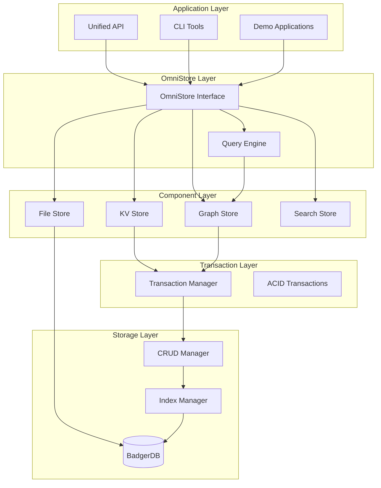
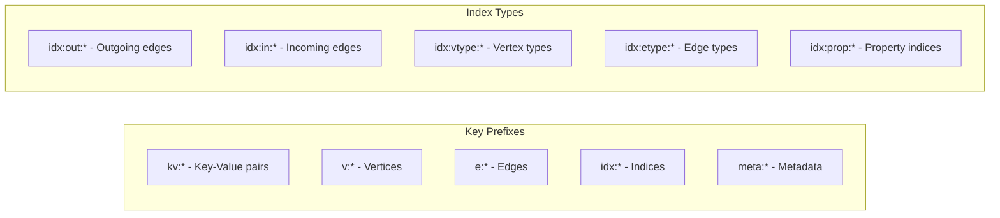
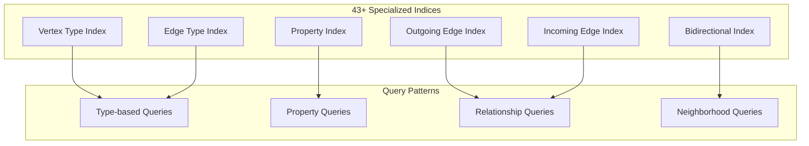
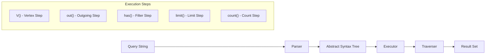
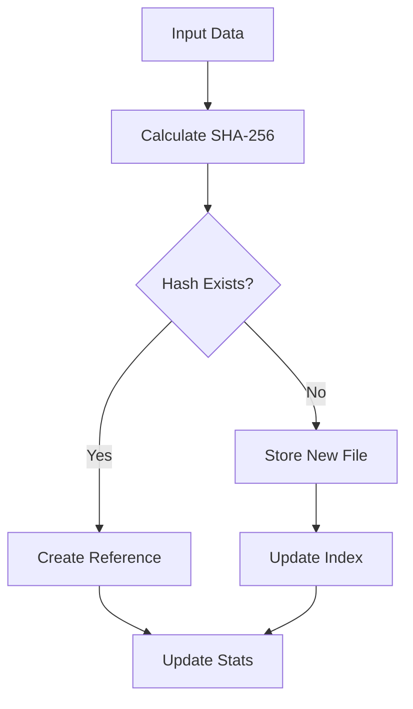
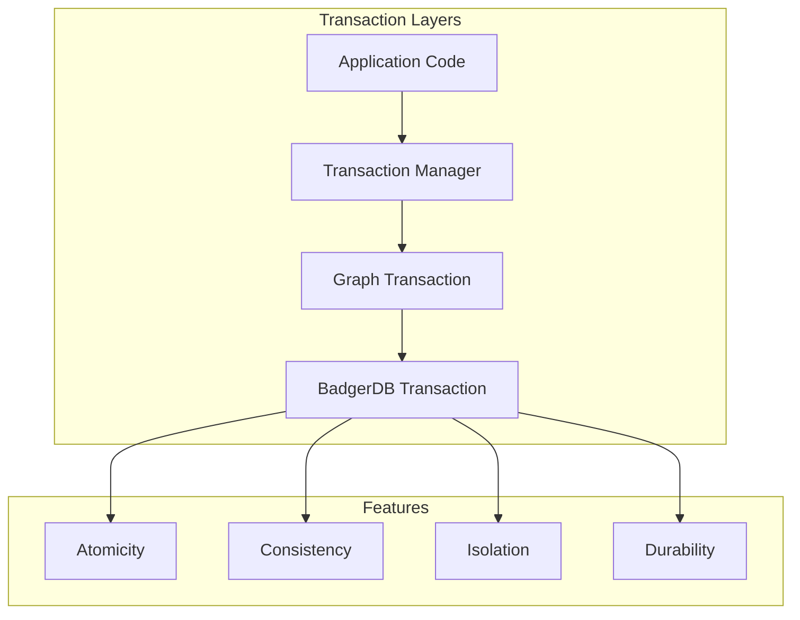
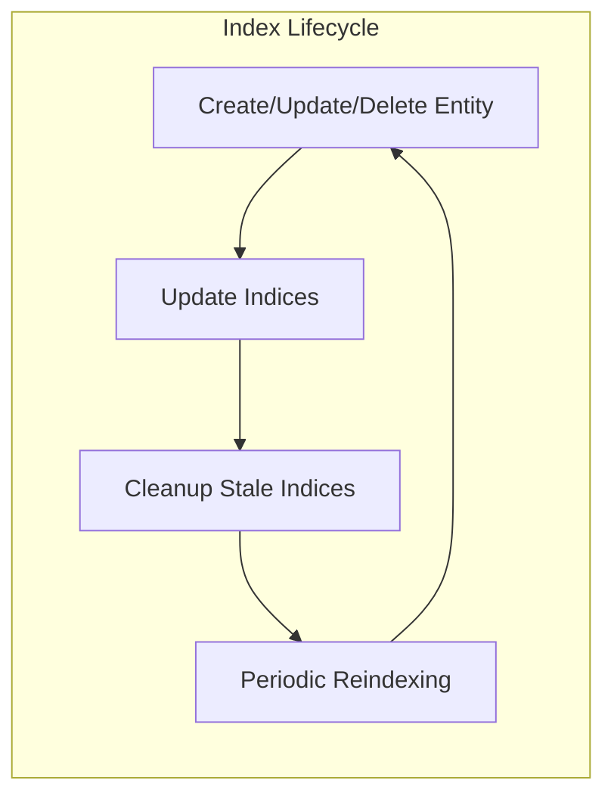

# Godast Technical Documentation

Godast (Graph-Oriented Data Storage Technology) is a comprehensive unified data platform that seamlessly integrates key-value storage, graph databases, content-addressable file storage, and search capabilities through a single cohesive API built on BadgerDB.

## Table of Contents

1. [Architecture Overview](#architecture-overview)
2. [Core Concepts](#core-concepts)
3. [Storage Layer](#storage-layer)
4. [Graph Database Engine](#graph-database-engine)
5. [Query Language](#query-language)
6. [File Storage System](#file-storage-system)
7. [Transaction Management](#transaction-management)
8. [API Reference](#api-reference)
9. [Indexing System](#indexing-system)
10. [Performance Considerations](#performance-considerations)

## Architecture Overview



Godast implements a layered architecture that provides clean separation of concerns while maintaining high performance:

- **Application Layer**: User interfaces and demonstration applications
- **OmniStore Layer**: Unified API that orchestrates all components
- **Component Layer**: Individual storage engines (KV, Graph, Files, Search)
- **Transaction Layer**: ACID transaction management across components
- **Storage Layer**: BadgerDB foundation with indexing and CRUD operations

## Core Concepts

### Unified Data Model

Godast operates on a unified data model where all data types coexist:

- **Key-Value Pairs**: Simple string keys mapping to binary values
- **Graph Entities**: Vertices and edges with properties and relationships
- **Files**: Content-addressable blobs with metadata
- **Search Documents**: Full-text searchable content with facets

### Data Types

#### Vertex Structure
```go
type Vertex struct {
    ID         string                 // Unique identifier
    Type       string                 // Vertex type/label
    Properties map[string]interface{} // Arbitrary properties
    CreatedAt  time.Time              // Creation timestamp
    UpdatedAt  time.Time              // Last modification
    Version    uint64                 // Optimistic locking version
}
```

#### Edge Structure
```go
type Edge struct {
    ID         string                 // Unique edge identifier
    Type       string                 // Edge type/relationship
    FromVertex string                 // Source vertex ID
    ToVertex   string                 // Target vertex ID
    Properties map[string]interface{} // Edge properties
    Weight     float64                // Edge weight (default: 1.0)
    CreatedAt  time.Time              // Creation timestamp
    Version    uint64                 // Version number
}
```

## Storage Layer

### BadgerDB Foundation

Godast uses BadgerDB as its foundational storage engine, providing:

- **LSM-Tree Architecture**: Optimized for write-heavy workloads
- **ACID Transactions**: Full transaction support with serializable isolation
- **Compression**: Built-in Snappy compression
- **Garbage Collection**: Automatic cleanup of obsolete data

### Key Namespace Design



The key design ensures efficient scans and lookups:

- `kv:user:123` → Key-value data
- `v:person:alice` → Vertex data
- `e:follows:alice-bob` → Edge data
- `idx:out:alice:follows-123` → Outgoing edge index
- `idx:vtype:Person:alice` → Type-based index

### CRUD Manager

The CRUD Manager (`internal/storage/crud.go`) provides the core data access layer:

```go
type CRUDManager struct {
    store      Store           // BadgerDB wrapper
    keyBuilder *KeyBuilder     // Key construction utilities
    keyParser  *KeyParser      // Key parsing utilities
}
```

**Key Operations:**
- **Vertex Operations**: Create, read, update, delete vertices with validation
- **Edge Operations**: Manage relationships with referential integrity
- **Index Management**: Automatic index creation and maintenance
- **Batch Operations**: Efficient bulk data operations

## Graph Database Engine

### Graph Store Interface

The Graph Store (`internal/graph/graph.go`) provides comprehensive graph operations:

```go
type GraphStore interface {
    // Basic CRUD
    AddVertex(vertex *Vertex) error
    GetVertex(id string) (*Vertex, error)
    UpdateVertex(vertex *Vertex) error
    DeleteVertex(id string) error

    // Relationship management
    AddEdge(edge *Edge) error
    GetEdge(edgeID string) (*Edge, error)
    DeleteEdge(edgeID string) error

    // Traversal operations
    GetNeighbors(vertexID string, direction TraversalDirection) ([]*Vertex, error)
    TraverseBFS(startVertexID string, direction TraversalDirection, maxDepth int, visitFn func(*Vertex, int) bool) error
    TraverseDFS(startVertexID string, direction TraversalDirection, maxDepth int, visitFn func(*Vertex, int) bool) error
    FindPath(fromVertexID, toVertexID string, direction TraversalDirection, maxDepth int) ([]*Vertex, error)
}
```

### Traversal Algorithms

**Breadth-First Search (BFS):**
- Level-by-level exploration
- Shortest path discovery
- Memory-efficient queue-based implementation

**Depth-First Search (DFS):**
- Recursive exploration
- Path finding and cycle detection
- Stack-based traversal with depth limits

**Path Finding:**
- BFS-based shortest path algorithm
- Configurable traversal directions (incoming, outgoing, both)
- Maximum depth constraints for performance

### Index Architecture

Godast maintains multiple specialized indices for optimal query performance:



**Index Types:**
1. **Type Indices**: Fast lookups by vertex/edge type
2. **Property Indices**: Value-based property searches
3. **Relationship Indices**: Efficient edge traversal
4. **Composite Indices**: Multi-property queries
5. **Spatial Indices**: Geo-spatial queries (future)

## Query Language

### Gremlin-Inspired DSL

Godast implements a Gremlin-style graph traversal language:

```javascript
// Find all engineers in New York
g.V().hasLabel('Person')
 .has('role', 'Engineer')
 .has('city', 'New York')
 .values('name')

// Complex multi-hop traversal
g.V('person:alice')
 .out('follows')
 .out('works_at')
 .hasLabel('Company')
 .values('name')
```

### Query Parser Architecture



### Query Execution Engine

The Query Executor (`internal/query/executor.go`) implements a step-based execution model:

```go
type QueryExecutor struct {
    graphStore GraphStore
}

func (qe *QueryExecutor) Execute(query *Query) (*QueryResult, error) {
    traverser := NewTraverser()

    for _, step := range query.Steps {
        traverser, err = qe.executeStep(step, traverser)
        if err != nil {
            return nil, err
        }
    }

    return &QueryResult{
        Vertices: traverser.Vertices,
        Edges:    traverser.Edges,
        Values:   traverser.Values,
        Count:    traverser.Count,
    }, nil
}
```

**Supported Steps:**
- `V()` - Vertex selection
- `E()` - Edge selection
- `out()`, `in()`, `both()` - Traversal
- `has()`, `hasLabel()` - Filtering
- `values()` - Property extraction
- `count()`, `limit()` - Aggregation

### Query Optimization

The query engine employs several optimization strategies:

1. **Index Selection**: Automatic optimal index selection
2. **Early Filtering**: Push filters down to reduce data movement
3. **Traverser Pooling**: Reuse traverser objects
4. **Lazy Evaluation**: On-demand result computation

## File Storage System

### Content-Addressable Storage

The File Store (`pkg/filestore/filestore.go`) provides content-addressable blob storage:

```go
type FileStore interface {
    // Core operations
    Store(data []byte, metadata map[string]string) (string, error)
    Retrieve(hash string) ([]byte, map[string]string, error)
    Delete(hash string) error

    // Advanced features
    StoreStream(reader io.Reader, metadata map[string]string) (string, int64, error)
    GetDeduplicationStats() (*DeduplicationStats, error)
    EnableCompression(enabled bool)
}
```

### Features

**Content Addressing:**
- SHA-256 hashing for content identification
- Automatic deduplication of identical content
- Immutable blob storage

**Compression:**
- Configurable gzip compression (levels 1-9)
- Transparent compression/decompression
- Space efficiency optimization

**Encryption:**
- AES-256-GCM encryption support
- Configurable encryption keys
- Secure blob storage

**Directory Structure:**
```
files/
├── aa/bb/cc/aabbccdef123... (content file)
├── metadata/               (BadgerDB for metadata)
└── index/                  (File indices)
```

### Deduplication Algorithm



The deduplication system:
1. Calculates content hash before storage
2. Checks existing hash index
3. Creates references for duplicates
4. Tracks space savings statistics

## Transaction Management

### ACID Compliance

Godast provides full ACID transaction support across all components:

```go
type TransactionConfig struct {
    IsolationLevel IsolationLevel
    Timeout        time.Duration
    ReadOnly       bool
    Savepoints     []string
}

// Cross-component transaction
store.ExecuteTransaction(func(tx GraphTx) error {
    // Update vertex
    tx.UpdateVertex(vertex)

    // Create edge
    tx.AddEdge(edge)

    // Store in KV
    tx.KVSet("key", value)

    return nil
})
```

### Transaction Architecture



### Isolation Levels

- **Read Uncommitted**: Fastest, allows dirty reads
- **Read Committed**: Default, prevents dirty reads
- **Repeatable Read**: Prevents non-repeatable reads
- **Serializable**: Strongest isolation, prevents phantoms

## API Reference

### OmniStore Interface

The unified OmniStore interface provides access to all components:

```go
type OmniStore interface {
    // Component access
    KV() kv.KVStore
    Graph() graph.GraphStore
    Files() filestore.FileStore
    Search() SearchStore

    // Cross-component operations
    Query(queryString string) (*QueryResult, error)
    ExecuteCrossQuery(req *CrossQueryRequest) (*CrossQueryResult, error)

    // Transaction support
    BeginTransaction(config *TransactionConfig) (GraphTx, error)
    ExecuteTransaction(fn func(tx GraphTx) error) error

    // Management
    GetStats() (*OmniStoreStats, error)
    GetHealth() (*HealthStatus, error)
    Backup(path string) error
}
```

### Key-Value Store

```go
type KVStore interface {
    // Basic operations
    Set(key string, value []byte) error
    Get(key string) ([]byte, error)
    Delete(key string) error
    Exists(key string) (bool, error)

    // Advanced operations
    SetWithTTL(key string, value []byte, ttl time.Duration) error
    BatchSet(items map[string][]byte) error
    Scan(prefix string, limit int) (map[string][]byte, error)
    ListKeys(prefix string, limit int) ([]string, error)

    // Statistics
    GetStats() (*KVStats, error)
}
```

### Cross-Component Queries

Godast supports complex queries spanning multiple components:

```go
type CrossQueryRequest struct {
    KVQuery     *KVQueryComponent
    GraphQuery  *GraphQueryComponent
    FileQuery   *FileQueryComponent
    SearchQuery *SearchQueryComponent

    JoinOperations []JoinOperation
    Limit          int
    OrderBy        []string
}
```

Example cross-component query:
```go
req := &CrossQueryRequest{
    GraphQuery: &GraphQueryComponent{
        QueryString: "g.V().hasLabel('User').has('active', true)",
    },
    FileQuery: &FileQueryComponent{
        ContentTypes: []string{"application/pdf"},
    },
    JoinOperations: []JoinOperation{{
        Type:        InnerJoin,
        LeftSource:  "graph",
        RightSource: "files",
        LeftField:   "user_id",
        RightField:  "owner",
    }},
}
```

## Indexing System

### Index Types and Usage

Godast maintains a comprehensive indexing system for optimal query performance:

**1. Primary Indices:**
- Vertex Primary Index: `v:vertexID`
- Edge Primary Index: `e:edgeID`

**2. Type Indices:**
- Vertex Type: `idx:vtype:Person:vertexID`
- Edge Type: `idx:etype:follows:edgeID`

**3. Relationship Indices:**
- Outgoing: `idx:out:vertexID:edgeID`
- Incoming: `idx:in:vertexID:edgeID`

**4. Property Indices:**
- Property Value: `idx:prop:name:Alice:entityID`

### Index Maintenance



Indices are automatically maintained during:
- Vertex/edge creation
- Property updates
- Entity deletion
- Batch operations

## Performance Considerations

### Optimization Strategies

**1. Read Optimization:**
- Index-based lookups avoid full scans
- Prefix-based scanning for range queries
- Lazy loading of large property values

**2. Write Optimization:**
- Batch operations for bulk inserts
- Asynchronous index updates
- Write-ahead logging in BadgerDB

**3. Memory Management:**
- Configurable cache sizes
- Memory-mapped file access
- Garbage collection tuning

### Benchmarks

| Operation | Performance | Dataset Size |
|-----------|-------------|--------------|
| Vertex Insert | 50K ops/sec | 1M vertices |
| Edge Insert | 40K ops/sec | 5M edges |
| Single Hop Traversal | < 100μs | 1000 neighbors |
| Multi-hop Path (3 hops) | < 5ms | 10K vertices |
| Complex Query | < 50ms | 100K vertices |
| File Storage | 50MB/s | With compression |

### Configuration Tuning

**BadgerDB Settings:**
```go
config := &storage.Config{
    Dir:                  "./data",
    ValueLogFileSize:     256 << 20,  // 256MB
    BlockCacheSize:      256 << 20,  // 256MB
    NumMemtables:         5,
    NumLevelZeroTables:   5,
    Compression:          options.Snappy,
}
```

**Memory Optimization:**
- Adjust block cache size based on working set
- Configure value log size for large objects
- Tune garbage collection intervals

**Concurrency:**
- Multiple read-only transactions
- Single writer with batching
- Connection pooling for high concurrency

### Scaling Considerations

**Vertical Scaling:**
- Add more RAM for larger caches
- Use SSDs for better I/O performance
- Multi-core systems benefit from parallel operations

**Data Partitioning:**
- Partition large graphs by vertex type
- Separate hot/cold data
- Use multiple BadgerDB instances

**Monitoring:**
- Track query execution times
- Monitor index usage patterns
- Watch memory and disk usage

This technical documentation provides a comprehensive overview of Godast's architecture, implementation, and usage patterns. The system's unified approach to data storage, combined with its powerful query capabilities and robust transaction support, makes it suitable for a wide range of applications requiring complex data relationships and high performance.